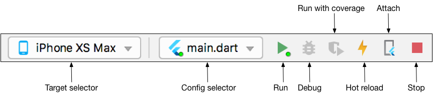

# Battery Charge Indicator using Flutter
This is a mobile application which is developed using Flutter as a framework so the application can be built as a native application in both iOS or Android application.

The application consists of three interactive components which are:

- Add Device ID field: A text field for the user to add the device ID which he would like to interact with.
- Submit Device ID button: The button to push the device ID which a user desire to interact with to the application setting.
- Toggle button: For controlling the device to turn it on or off.

And there is an informative component which is battery status which shows as a big icon in the middle with text generated from the system showing the battery percentage of the mobile phone.

Since this application need to be configurated the API inorder to work wtih a physical device. We reccomand you to build and run with your editor.
# Requirement

### Framwork
- [Flutter](https://docs.flutter.dev/get-started/install)

### Editor
You can follow the link of each editor which will lead you to the set up for each of them
- [Andriod Studio (Reccommand)](https://docs.flutter.dev/get-started/editor?tab=androidstudio)
- [Visual Studio Code](https://docs.flutter.dev/get-started/editor?tab=vscode)
- [Emacs](https://docs.flutter.dev/get-started/editor?tab=emacs)

# How to install and run our project locally?
**1.** Clone our repository, and go to directory where you clone the repo.

```
git clone https://github.com/KorawitRupanya/BatteryCheckerFlutter.git
```

```
cd BatteryCheckerFlutter
```
<hr>

**2.** Run & Config the application.

This we will cover on how to build and run application locally on Macbook with Andriod Studio for other editor you can find it in the same link as the set up link but go to Test drive section.

1. Open the IDE and choose Open.


2. There will be an error appears in the IDE. Click Get dependencies to install all dependencies


3. Follow instuction here ``https://github.com/cinapr/RetrofitOldAppliances`` to run the API which is for connecting the application to the smartplug

4. Config the API gateway of the application to connect with the smartplug in the ``lib/main.dart``.
If you want to run the application using the simulator, you have to change the API to the port that has an API running. <em>But</em> if you want to run the application on a physical device(you have to connect your device with a cable first) you have to change the ``localhost`` to an accessible local port digit of your computer along with the port that has the API running.

5. Locate the main Android Studio toolbar


6. In the target selector, select a device for running the app. If none are listed as available, select Tools > AVD Manager and create one there for running an Android emulator. For running on iOS Simulator, click Open iOS simulator from the target selector, then create one device from the Simulator. Or just connect your computer to a physical device in order to to show it in the target selector.


7. Click the run icon in the toolbar, or invoke the menu item Run > Run.

8. There is a web application for registering user, device, schedule: 
A web server for the frontend to registering users, controlled devices, and the schedule.
Follow the instruction here : ```https://github.com/Bamistand/IOT_Frontend_Project.git```